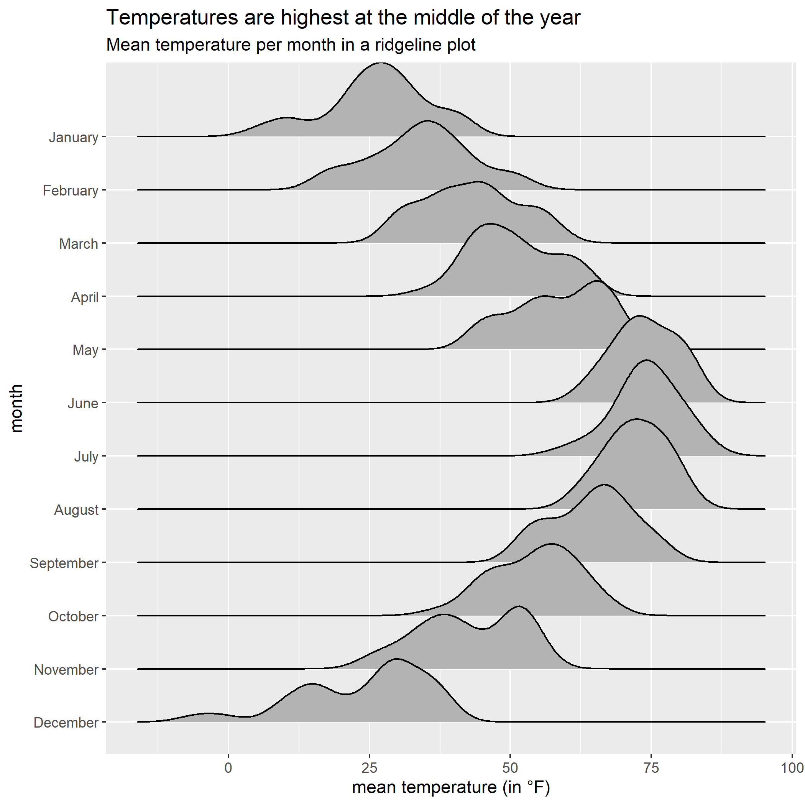
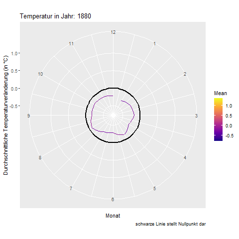

```{r setup, include=FALSE}
knitr::opts_chunk$set(echo = TRUE)
```

# Mean temperature per month in a ridgeline plot


# Global surface temperature change 
### Development from 2000 to 2016 in violin plot


### Animated development from 1880 to 2016
Here you can see my first attempt at a gif!


# Top 10 highest GDP per capita from 1952 to 2007


# Comparison of films with the bachdel review "ok" vs. "men" over the years


# German parliamentary elections of 2017
This visualization displays the results of the preliminary elections of 2017.


