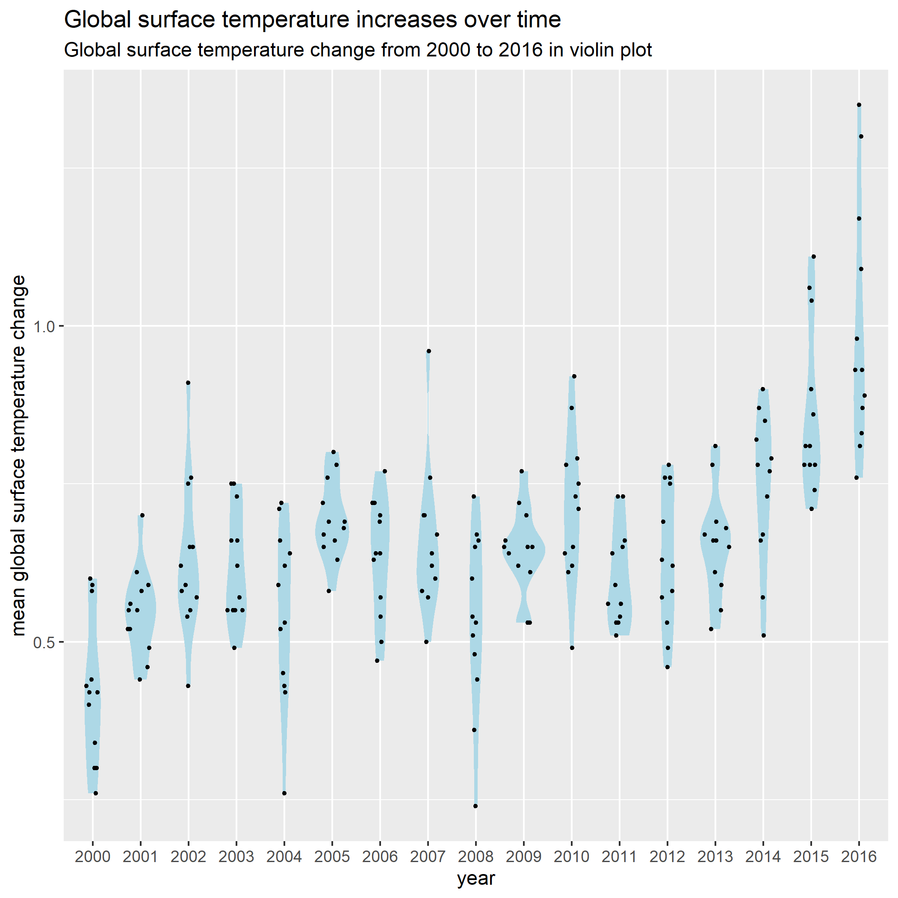
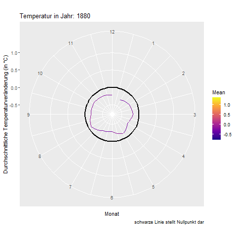

```{r setup, include=FALSE}
knitr::opts_chunk$set(echo = TRUE)
```

## Development from 2000 to 2016 in violin plot


## Animated development from 1880 to 2016
This is my first attempt at a gif!  

